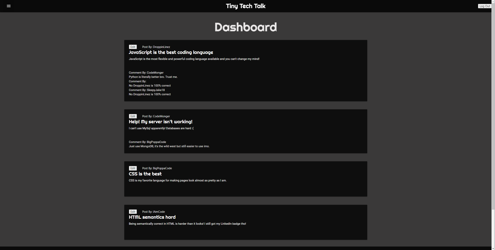

# ReadMe

## Description
This is full stack tech blog built from the ground up using MySql, Node.js, JavaScript, HTML, CSS, and Handlebars. Users can make account, adds and delete posts and comments.

## Table of Contents
- [Installation](#installation)
- [Usage](#usage)
- [Credits](#credits)
- [License](#license)
- [Questions](#questions)

## Installation
Download my open source code from my repository

## Usage
Use on my deployed heroku app

## Credits
SleepyJake18

## License 

Licensed under the [MIT](https://opensource.org/licenses/MIT) license
## Tests
N/A

## Questions
[SleepyJake18](https://github.com/SleepyJake18) 

[jsmartin01@gmail.com](mailto:jsmartin01@gmail.com)
